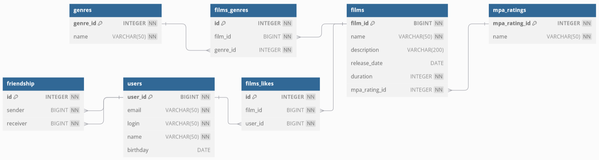

# java-filmorate

## Проект, предназначенный для оценки фильмов пользователями

### Схема хранения данных в БД:



### Примеры запросов:

#### Добавить пользователя

`POST /users`

Тело запроса:

```json
{
  "login": "dolore",
  "name": "Nick Name",
  "email": "mail@mail.ru",
  "birthday": "1946-08-20"
}
```

#### Обновить пользователя

`PUT /users`

Тело запроса:

```json
{
  "id": 1,
  "login": "dolore",
  "name": "Nick Name",
  "email": "mail@mail.ru",
  "birthday": "1946-08-20"
}
```

#### Получить пользователя по ИД

`GET /users/{id}`

#### Получить список всех пользователей

`GET /users`

#### Добавить пользователя в друзья

`PUT /users/{id}/friends/{friendId}`

#### Добавить фильм

`POST /films`

Тело запроса:

```json
{
  "name": "nisi eiusmod",
  "description": "adipisicing",
  "releaseDate": "1967-03-25",
  "duration": 100
}
```

#### Обновить фильм

`PUT /films`

Тело запроса:

```json
{
  "ID": 1,
  "name": "nisi eiusmod",
  "description": "adipisicing",
  "releaseDate": "1967-03-25",
  "duration": 100
}
```

#### Получить фильм по ИД

`GET /films/{id}`

#### Получить список всех фильмов

`GET /films`

#### Поставить лайк фильму от пользователя

`PUT /films/{id}/like/{userId}`

#### Получить список популярных фильмов

`PUT /films/popular?count=100`

Необязательный параметр _count_. Значение по умолчанию: 10.